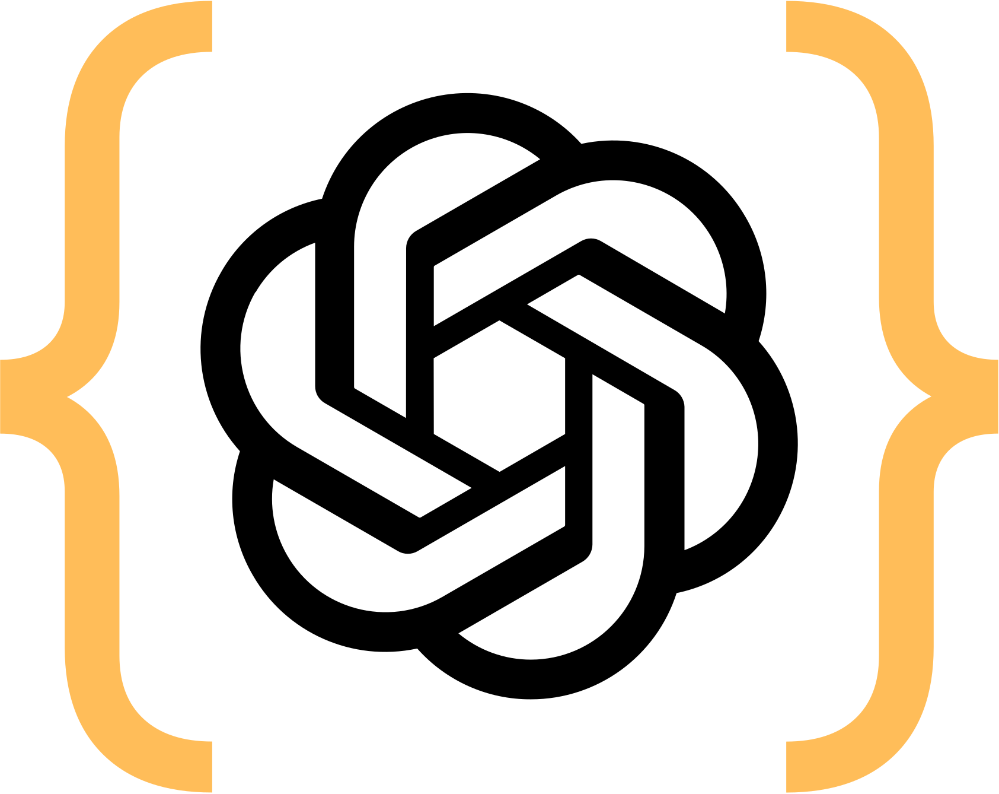

<p align="center">
  
</p>

# n8n-nodes-openai-structured-outputs

This is a community node for n8n that enables you to extract structured JSON from unstructured text by leveraging OpenAI’s **Structured Outputs** feature with a user‑provided JSON Schema.

---

## Installation

You can install **n8n-nodes-openai-structured-outputs** in two ways—via npm or directly from the n8n app.

---

### 1. Install via npm

1. In your project (or globally), run:

   ```bash
   npm install n8n-nodes-openai-structured-outputs
   ```

2. **Restart** your n8n instance to load the new node.

---

### 2. Install from the n8n App (Community Nodes)

> **Note:** Only the n8n instance owner can install and manage community nodes.

1. In n8n, go to **Settings → Community Nodes**.
2. Click **Install**.
3. Click **Browse**—n8n will show npm packages tagged `n8n-community-node-package`.
4. Search for and select **n8n-nodes-openai-structured-outputs**.
   - To install a specific version, append `@<version>` (e.g. `n8n-nodes-openai-structured-outputs@0.1.7`).
5. Check **“I understand the risks of installing unverified code from a public source”**, then click **Install**.
6. After installation, the **OpenAI Structured Output** node appears under **Community Nodes → Utility**.

---

### 3. Uninstall, Upgrade or Downgrade

- **Uninstall**: In **Settings → Community Nodes**, click the three-dot menu next to **OpenAI Structured Output** and choose **Uninstall**.
- **Upgrade to Latest**: If a new version is available, an **Update** button appears next to the node—click it to upgrade.
- **Install Specific Version**: Uninstall first, then reinstall using the exact npm package name with version (e.g. `n8n-nodes-openai-structured-outputs@0.2.0`).
- **Downgrade**: Same as installing a specific older version.

---

_For full details and additional community-node management guidance, see the official docs:_  
https://docs.n8n.io/integrations/community-nodes/installation/

---

## Operations

### Extract JSON

Use the **Extract JSON** operation to send text to the OpenAI Chat Completions endpoint with your JSON Schema injected into `response_format`. The node will:

1. Call `POST /v1/chat/completions` with:

   - `model` (selectable)
   - `messages`: system prompt + user text
   - `response_format`: `{ type: "json_schema", json_schema: { name, schema, strict: true } }`
   - optional parameters like `temperature`

2. Receive the AI’s response, automatically:
   - **Validate** HTTP errors (`4xx`/`5xx`)
   - **Parse** the first choice’s `message.content` as JSON
   - **Validate** the parsed JSON against your schema (using AJV with coercion, defaults, and stripping extra fields)
   - **Output**:
     ```jsonc
     {
     	"parsed": {
     		/* your valid JSON */
     	},
     	"errors": [
     		/* AJV errors, if any */
     	],
     }
     ```

#### Node Parameters

| Parameter   | Name          | Type    | Default  | Description                                               |
| ----------- | ------------- | ------- | -------- | --------------------------------------------------------- |
| Model       | `model`       | options | `gpt-4o` | OpenAI model to use (e.g. `gpt-4o-mini`, `o3-mini`, etc.) |
| JSON Schema | `jsonSchema`  | json    | `""`     | A valid JSON Schema (injected into `response_format`)     |
| Text        | `text`        | string  | `""`     | Input text from which to extract structured data          |
| Temperature | `temperature` | number  | `1`      | Sampling temperature (0–1)                                |

---

## Credentials

This node uses the built‑in `OpenAI API` credential:

1. **API Key** (required)
2. **Organization ID** (optional)
3. **Base URL** (defaults to `https://api.openai.com/v1`)

Configure these under **Settings → API Credentials → OpenAI** in n8n.

---

## Compatibility

- **n8n version:** ≥ 1.x with Community Nodes API v1
- **Node.js:** ≥ 18.10
- **AJV version:** 8.x (bundled)

---

## Usage

1. Add the **OpenAI Structured Output** node to your workflow.
2. Select **Extract JSON**.
3. Fill in your **Model**, paste or compose your **JSON Schema**, and supply the **Text**.
4. Connect an output to inspect:
   - `parsed`: the coerced, default‑filled, extra‑fields‑removed object
   - `errors`: any AJV validation errors

You can chain this into further nodes (e.g., write to a database, send an email) knowing the JSON conforms to your schema.

---

## JSON Schema Reference

We leverage the industry‑standard **JSON Schema** draft (see official docs):  
https://json-schema.org/understanding-json-schema/

### Notes on Keyword Support

OpenAI’s Structured Outputs supports many common JSON Schema keywords, but also has explicit limitations. Below is a summary of what works (✔) and what does **not** (✘) for each data type:

#### String

- ✔ **type**
- ✔ **enum**
- ✔ **const**
- ✔ **contentEncoding** (if supported)
- ✔ **contentMediaType** (if supported)
- ✘ **minLength**, **maxLength**, **pattern**, **format**

#### Number & Integer

- ✔ **type**
- ✔ **enum**
- ✔ **const**
- ✔ **exclusiveMinimum**, **exclusiveMaximum**
- ✘ **minimum**, **maximum**, **multipleOf**

#### Boolean

- ✔ **type**
- ✔ **enum**
- ✔ **const**

#### Object

- ✔ **type**
- ✔ **properties**
- ✔ **required** (mandatory): an array that **must** list **all** property names declared under `properties`.
- ✔ **additionalProperties** (mandatory): must be explicitly set (`false` or a subschema) to control extra fields.
- ✔ **dependencies** (if supported)
- ✔ **patternDependentSchemas** (if supported)
- ✘ **patternProperties**, **unevaluatedProperties**, **propertyNames**, **minProperties**, **maxProperties**

#### Array

- ✔ **type**
- ✔ **items**
- ✔ **additionalItems**
- ✔ **prefixItems** (if supported)
- ✘ **unevaluatedItems**, **contains**, **minContains**, **maxContains**, **minItems**, **maxItems**, **uniqueItems**

#### General (Multiple Types)

- ✔ **enum**
- ✔ **const**
- ✔ **anyOf**
- ✔ **allOf** (not explicitly unsupported)
- ✘ **oneOf**, **not** (unsupported or untested)
- ✔ **if**, **then**, **else** (if supported)
- ✔ **description**, **title**
- ✘ **default**
- ✘ **$ref**, **$defs/definitions** (no external references)

> **Tip:** Schema reuse via `$defs` inside the same document may work, but external `$ref` is not supported.

---

## Resources

- **n8n Community Nodes**: https://docs.n8n.io/integrations/community-nodes/
- **OpenAI Chat Completions**: https://platform.openai.com/docs/guides/chat/introduction
- **JSON Schema Official**: https://json-schema.org/understanding-json-schema/

---

## Version History

- **0.1.0** (2025‑04‑22)
  - Initial release: Extract JSON via OpenAI Structured Outputs with full AJV validation, coercion, defaults, and extra‑field removal.

---

_Created by Crucerlabs · MIT License_
